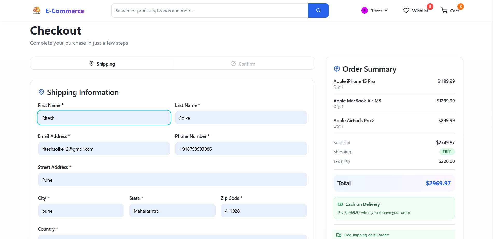

# 🛍️ E-Commerce Platform

A modern, full-stack e-commerce application with responsive design, real-time product browsing, shopping cart functionality, and secure authentication.

**Live Demo:** 
- 🌐 Frontend: [https://e-commerce-beryl-five-53.vercel.app](https://e-commerce-beryl-five-53.vercel.app)
- 📡 Backend API: [https://e-commerce-4kpd.onrender.com](https://e-commerce-4kpd.onrender.com)

---

## 📸 Screenshots

### Homepage with Hero Section

### Product Categories

### Super Dhamaka Offers Section

### Shopping Cart

### Product Details

### Checkout Page

---

## 🚀 Live Demo

Visit the application: **[https://e-commerce-beryl-five-53.vercel.app](https://e-commerce-beryl-five-53.vercel.app)**

---

## 💻 Tech Stack

### **Frontend**
- **React 18** - UI Library
- **TypeScript** - Type Safety
- **Vite** - Build Tool (Lightning Fast ⚡)
- **Tailwind CSS** - Styling
- **React Router v6** - Routing
- **Shadcn/UI** - UI Components
- **Lucide React** - Icons
- **Axios** - HTTP Client

### **Backend**
- **Node.js** - Runtime
- **Express.js** - Web Framework
- **MongoDB** - NoSQL Database
- **Mongoose** - ODM
- **JWT** - Authentication
- **CORS** - Cross-Origin Support
- **Dotenv** - Environment Variables

### **Deployment**
- **Vercel** - Frontend Hosting
- **Render** - Backend Hosting
- **MongoDB Atlas** - Cloud Database

### **Version Control**
- **Git** - Version Control
- **GitHub** - Repository

---

## 🎯 Features

### ✅ Implemented
- [x] Responsive Design (Mobile, Tablet, Desktop)
- [x] Product Categories & Subcategories (25+)
- [x] Dynamic Product Display
- [x] Shopping Cart Management
- [x] CORS Enabled (Frontend-Backend Communication)
- [x] Modern UI with Tailwind CSS
- [x] Hero Section with Carousel
- [x] Super Dhamaka Offers Section
- [x] Product Filtering
- [x] Countdown Timer
- [x] Rating System
- [x] Brand Filtering

### 🔄 In Progress
- [ ] User Authentication (JWT)
- [ ] Order Management
- [ ] Payment Integration (Stripe/Razorpay)
- [ ] User Profile Management
- [ ] Reviews & Ratings
- [ ] Wishlist Feature

---

## 📁 Project Structure

